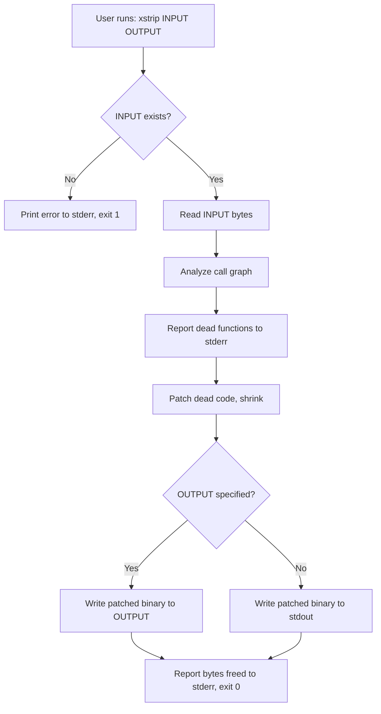
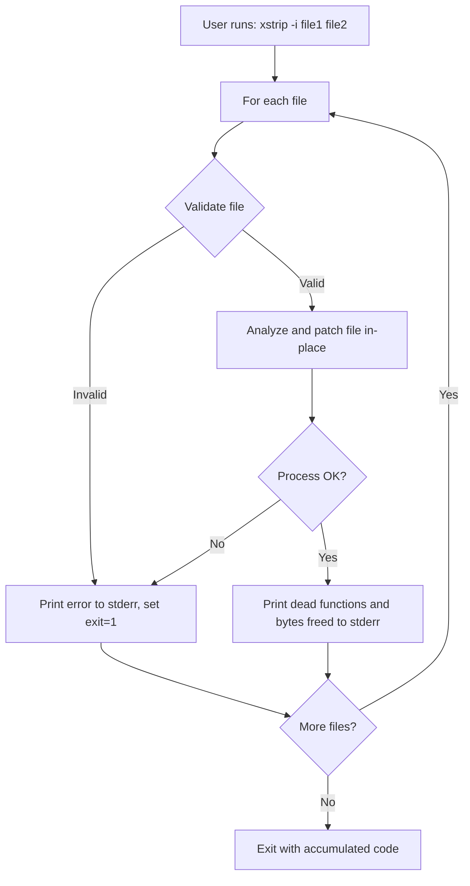
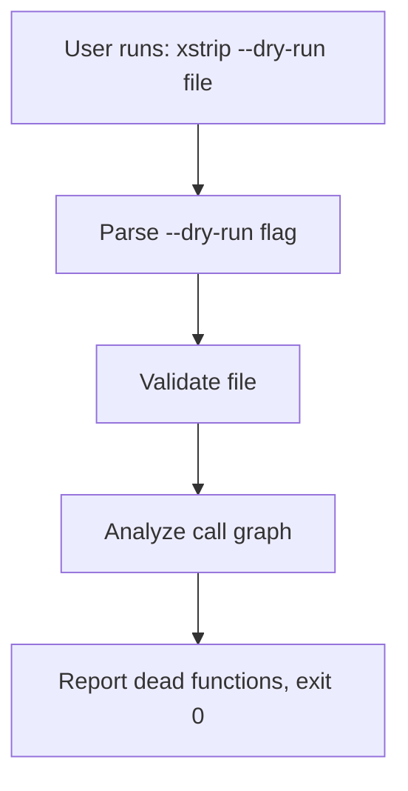
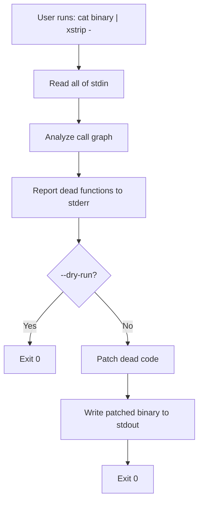

# xstrip -- Specification

**Version:** 0.1.0

## 1. What the System Does

xstrip is a dead code analyzer and remover for compiled binaries. It
supports ELF, PE/COFF, Mach-O, .NET managed assemblies, and WebAssembly
modules. It finds unreachable functions using address-based call graph
analysis (or IL call graph for .NET / Wasm call graph), patches dead code,
and physically shrinks ELF, PE, and Mach-O binaries by removing dead code
regions, patching instruction offsets, and updating format metadata. It
works directly on compiled binaries — no source code or recompilation
needed.

xstrip is a static musl binary (Rust) with zero runtime dependencies,
distributed as a scratch-based Docker image or standalone binary for
x86_64 and aarch64 Linux.

## 2. What the System Solves (Business Values)

- **Dead code removal:** Finds and removes unreachable functions from
  compiled binaries, reducing attack surface and binary size.
- **Multi-format:** Supports ELF (Linux), PE/COFF (Windows), Mach-O
  (macOS), .NET managed assemblies, and WebAssembly modules.
- **Multi-architecture:** Analyzes x86-64, x86-32, AArch64, ARM32,
  RISC-V, MIPS, s390x, and LoongArch64 instruction sets across all
  supported formats, plus WebAssembly function-level analysis.
- **No source needed:** Works on any supported binary — no recompilation,
  no build system integration required.
- **No host dependencies:** Available as a static binary or scratch Docker
  image (~2 MiB). No LLVM, Python, or shared libraries needed at runtime.
- **CI/CD integration:** Can be used as a build step in any pipeline.
- **Multi-arch host:** Runs on x86_64 and aarch64 Linux.

## 3. How the System Does It (Architecture)

### 3.1 Components

| Component      | File                 | Description                              |
|----------------|----------------------|------------------------------------------|
| Rust Binary    | `src/`               | Dead code analyzer/patcher (static musl) |
| Docker Image   | `Dockerfile`         | Multi-arch build via xx, scratch runtime |
| Compose Config | `docker-compose.yml` | Easy invocation via compose              |
| Dist Script    | `dist.sh`            | Extract static binaries for amd64+arm64  |

### 3.2 Processing Flow

```text
+----------------------------+
| User passes file path(s)  |
| as CLI arguments           |
+----------------------------+
            |
            v
+----------------------------+
| xstrip validates:          |
|   - file exists            |
|   - file is writable       |
|   - file is not symlink    |
|     outside /work          |
+----------------------------+
            |
            v
+----------------------------+
| Analyze: detect format,    |
| decode instructions, build |
| call graph, BFS from roots |
+----------------------------+
            |
            v
+----------------------------+
| Patch: compact dead code,  |
| patch instruction offsets, |
| update format metadata     |
+----------------------------+
            |
            v
+----------------------------+
| Reports dead functions     |
| and bytes freed            |
+----------------------------+
```

### 3.3 Docker Image Structure

Multi-arch build using `tonistiigi/xx`:

| Stage    | Base                       | Purpose                           |
|----------|----------------------------|-----------------------------------|
| xx       | `tonistiigi/xx:1.9.0`      | Cross-compilation helper          |
| builder  | `rust:1.93-alpine3.23`     | Cross-compile static musl binary  |
| export   | `scratch`                  | Binary extraction for dist builds |
| runtime  | `scratch`                  | Static binary only, zero deps     |

Supported platforms: `linux/amd64` (`x86_64-unknown-linux-musl`),
`linux/arm64` (`aarch64-unknown-linux-musl`).

---

## 4. Use Cases

### UC-001: Analyze and Patch a Single Executable (Stream Mode)

**Summary:** User finds and removes dead code from one executable,
writing the patched binary to an output file or stdout.

**Description:** The user runs xstrip with an input path and optional
output path. xstrip reads the input file, analyzes the call graph,
identifies dead functions, patches them out, and writes the result to
the output file or stdout. The input file is never modified. All
diagnostic output goes to stderr.

**Related BR/WF:** BR-001, BR-002, BR-003, WF-001

**Flow (Mermaid):**



**Baseline screenshots:** N/A (CLI tool, no UI)

**Failure modes (user-visible):**

- File not found: "Error: '<path>' not found"
- Output write failure: "Error: cannot write '<path>'"
- No functions found: "skipped: no functions detected"

---

### UC-002: In-Place Modification (Single or Multiple Files)

**Summary:** User modifies files in-place using the `--in-place` flag.

**Description:** The user passes `--in-place` (or `-i`) with one or more
file paths. Each file is validated, analyzed, and patched in-place. Errors
on one file do not prevent processing of subsequent files. The exit code
is 1 if any file failed, 0 if all succeeded. All diagnostic output goes
to stderr.

**Related BR/WF:** BR-001, BR-002, BR-004, WF-001

**Flow (Mermaid):**



**Baseline screenshots:** N/A (CLI tool, no UI)

**Failure modes:** Same as UC-001, per file, plus:

- File not writable: "Error: '<path>' is not writable"
- Symlink outside /work: "Error: '<path>' is a symlink outside /work"

---

### UC-003: Analyze Only (Read-Only Mode)

**Summary:** User analyzes dead code without modifying the binary.

**Description:** With the `--dry-run` flag, xstrip performs full
call graph analysis and reports dead functions but does not patch or
modify the file. Useful for auditing before committing to changes.

**Related BR/WF:** BR-001, WF-001

**Flow (Mermaid):**



**Baseline screenshots:** N/A (CLI tool, no UI)

**Failure modes:** Same as UC-001.

---

### UC-004: Pipe Mode (stdin to stdout)

**Summary:** User pipes a binary through xstrip via stdin/stdout.

**Description:** The user passes `-` as the input argument. xstrip reads
the binary from stdin, analyzes the call graph, patches dead code, and
writes the patched binary to stdout. All diagnostic output goes to stderr.
Can be combined with `--dry-run` to analyze only.

**Related BR/WF:** BR-001, BR-005, WF-001

**Flow (Mermaid):**



**Baseline screenshots:** N/A (CLI tool, no UI)

**Failure modes (user-visible):**

- Empty stdin: "skipped: no functions detected"
- Invalid binary on stdin: "skipped: no functions detected"

---

## 5. Business Rules

### BR-001: Stream-First Output

By default, xstrip reads an input file and writes the patched binary to
an output file or stdout. In-place modification requires the explicit
`--in-place` / `-i` flag. All diagnostic output goes to stderr.

### BR-002: Format Auto-Detection

xstrip auto-detects the binary format from magic bytes. No format flag
is needed from the user. Detection order: ELF (`\x7fELF`), .NET (MZ +
CLI header), PE/COFF (MZ), Mach-O (feed_face/feed_facf/cefa_edfe/cffa_edfe).

### BR-003: Supported Formats

The tool supports ELF (Linux), PE/COFF (Windows), Mach-O (macOS),
.NET managed assemblies, and WebAssembly modules. Architecture support
includes x86-64, x86-32, AArch64, ARM32, RISC-V (RV32/RV64),
MIPS (32/64, big/little-endian), s390x, and LoongArch64 across all
native formats. .NET uses IL-level analysis independent of CPU
architecture. WebAssembly uses function-level call graph analysis.

### BR-004: Independent File Processing

When multiple files are given, each is processed independently. An error
on one file does not prevent processing of other files.

### BR-005: Analyze-Only vs Patch

Default behavior analyzes and patches dead code. The `--dry-run`
flag reports dead functions without producing binary output. Works in
all modes: stream, pipe, and in-place.

### BR-006: Non-Root Execution

The container MUST run as a non-root user (uid 10000, user `xstrip`).

### BR-007: Dead Branch Detection (SDD-011)

In addition to whole dead functions, xstrip detects dead branches within
live functions. Three levels of analysis:

1. **CFG-based** (Phase A — implemented): unreachable basic blocks — code
   after calls to noreturn functions (`exit`, `abort`, `__stack_chk_fail`)
   resolved via both symbol table and PLT/IAT import names.
2. **Intra-function compaction** (Phase B — implemented): dead blocks
   within functions are fed into the compaction pipeline alongside dead
   functions. Live code is shifted, all branch offsets and references are
   patched, freed tail bytes are reclaimed.
3. **Data-flow provable** (Phase C — implemented): SSA construction +
   register-based constant propagation proves branches that can never be
   taken based on constant analysis of register values. Conservative:
   memory treated as unknown at all times, caller-saved registers
   clobbered at call sites, indirect branches assume all targets live.
   Works on all native architectures (x86-64, x86-32, AArch64, ARM32,
   RISC-V, MIPS, s390x, LoongArch64).

Dead branches are reported alongside dead functions in analysis output.
Dead blocks are compacted through the same pipeline as dead functions.

### BR-008: Physical Compaction (SDD-013)

For native binary formats (ELF, PE, Mach-O), xstrip physically removes
dead code from the .text section and patches all affected metadata:

- **ELF:** All architectures. Patches entry point, section/program
  headers, .rela.dyn/.rela.plt relocations, .symtab/.dynsym symbols,
  .dynamic section addresses, data pointers (.got, .init_array, etc.).
  Big-endian aware for s390x and MIPS.
- **PE:** All architectures. Patches AddressOfEntryPoint, section
  headers (VirtualSize, SizeOfRawData, PointerToRawData), SizeOfCode,
  SizeOfImage, COFF symbols, export address table (EAT), base
  relocations (.reloc HIGHLOW/DIR64), and .pdata exception entries.
- **Mach-O:** All architectures. Patches LC_MAIN/LC_UNIXTHREAD entry
  point, LC_SEGMENT_64/LC_SEGMENT load commands (vmaddr, vmsize,
  fileoff, filesize), section headers, and LC_SYMTAB nlist entries.

Per-architecture instruction offset patching handles branch/call
recalculation for all supported architectures.

### BR-009: Wasm & .NET Dead Branch Detection (SDD-013)

In addition to dead function detection, xstrip detects dead branches
within live function/method bodies for bytecode formats:

- **WebAssembly:** Detects unreachable code after `unreachable` (0x00),
  `return` (0x0F), and unconditional `br` (0x0C) opcodes until the
  next control flow boundary (`end`/`else`). Dead regions are filled
  with `nop` (0x01) during reassembly.
- **.NET IL:** Detects unreachable code after `throw` (0x7A), `ret`
  (0x2A), unconditional `br` (0x38/0x2B), and `rethrow` (0xFE 0x1A)
  until the next branch target.

---

## 6. Workflows

### WF-001: Dead Code Removal Workflow

1. Parse CLI options (`--in-place`, `--dry-run`, `--help`, `--version`,
   `--license`)
2. If `--version` / `-v`: print version to stdout, exit 0
3. If `--license` / `-l`: print MIT license to stdout, exit 0
4. Determine mode:
   - `--in-place` + files → in-place mode (UC-002)
   - Input is `-` → pipe mode: read stdin (UC-004)
   - One positional arg → stream mode: write to stdout (UC-001)
   - Two positional args → stream mode: write to output file (UC-001)
5. Read input data (file or stdin)
6. Analyze:
   a. Detect format (ELF/PE/Mach-O/.NET) from magic bytes
   b. Parse headers and symbol tables
   c. Decode instructions (x86/ARM) or IL (.NET)
   d. Build call graph from branch/call targets or IL opcodes
   e. BFS reachability from roots (entry, globals, data refs)
   f. Report dead functions found (to stderr)
7. If `--dry-run`: exit 0 (no binary output)
8. Patch dead code (ELF/PE/Mach-O: compact + update metadata;
   Wasm/dotnet: zero-fill dead functions + nop dead branches)
9. Write output:
   - In-place mode: overwrite each file
   - Stream mode: write to output file or stdout
   - Pipe mode: write to stdout
10. Report bytes freed (to stderr)
11. Exit 0 if all files succeeded, 1 if any failed
